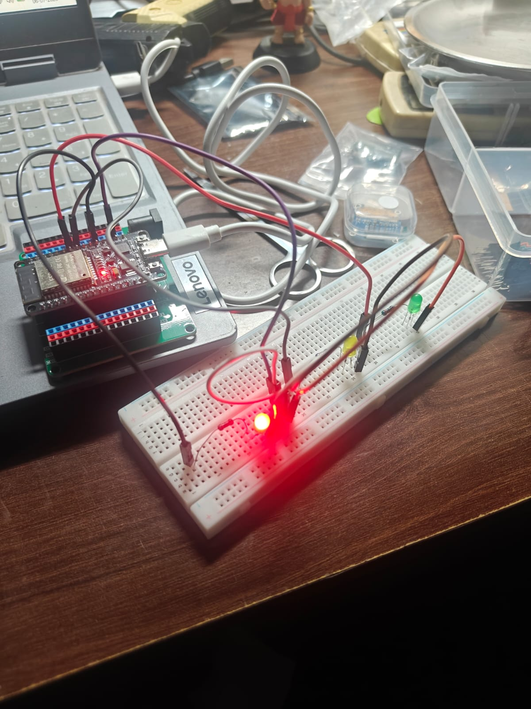

# ESP32 Traffic Light Project - Version 1

## Overview

This is the first version of my ESP32 Traffic Light project.

The project simulates a basic traffic light using three external LEDs connected to an ESP32 Development Board. It demonstrates controlling multiple GPIO pins and implementing a timed traffic light sequence using the Arduino framework.

---

## Components Used

- ESP32 Development Board
- Breadboard
- Red LED
- Yellow LED
- Green LED
- 3 × 220Ω Resistors
- Jumper Wires
- USB Cable

---

## Circuit Connections

- Red LED → GPIO 4
- Yellow LED → GPIO 5
- Green LED → GPIO 18
- All LED cathodes → GND
- Each LED connected in series with a 220Ω resistor

---

## Traffic Light Sequence

| Signal | Duration |
| :----- | -------: |
| 🔴 Red | 5 seconds |
| 🟢 Green | 5 seconds |
| 🟡 Yellow | 2 seconds |

The sequence repeats continuously.

---

## Concepts Learned

- Controlling multiple GPIO outputs
- Digital Output
- `pinMode()`
- `digitalWrite()`
- `delay()`
- Sequential program execution
- Basic embedded system timing

---

## Challenges Faced

- Wiring multiple LEDs correctly
- Managing multiple GPIO pins
- Designing a sequential traffic light pattern
- Verifying the timing of each traffic signal

---

## Future Improvements

- Organize the code using functions
- Replace `delay()` with `millis()` for non-blocking timing
- Add a pedestrian crossing button
- Implement a Finite State Machine (FSM)
- Expand the project into a realistic traffic light controller

---

## Images

### Circuit Diagram

### Demo

